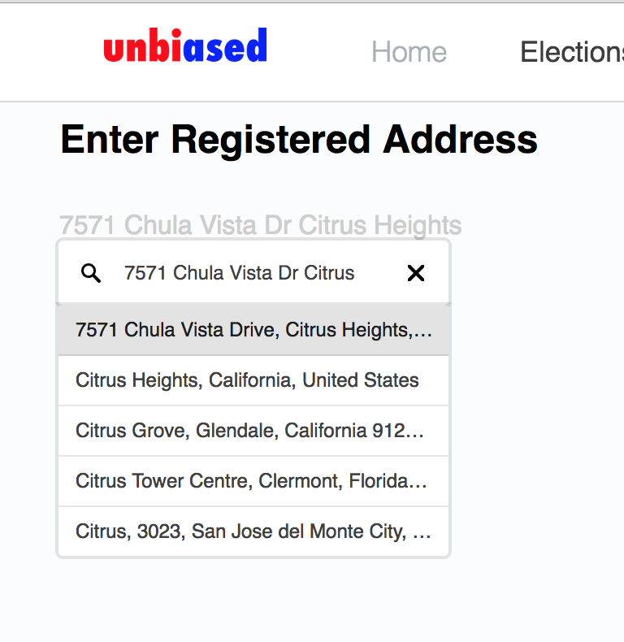
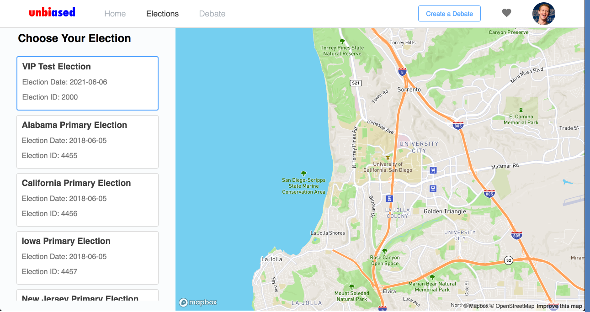
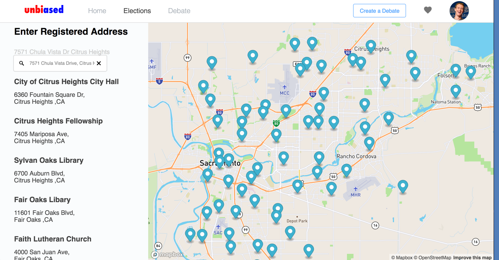
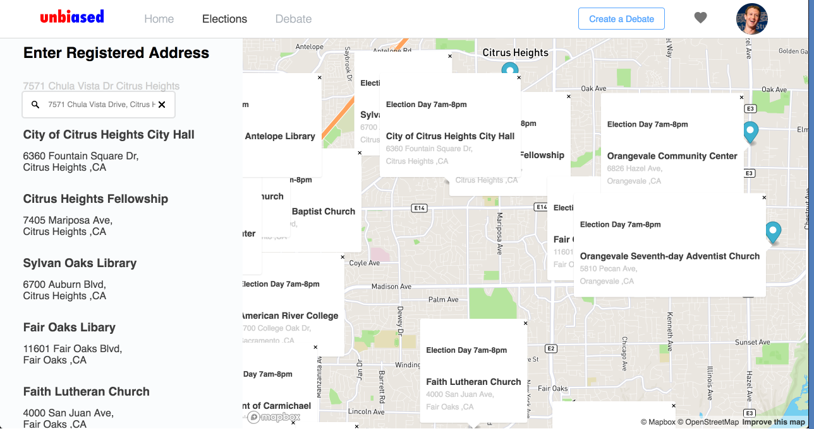
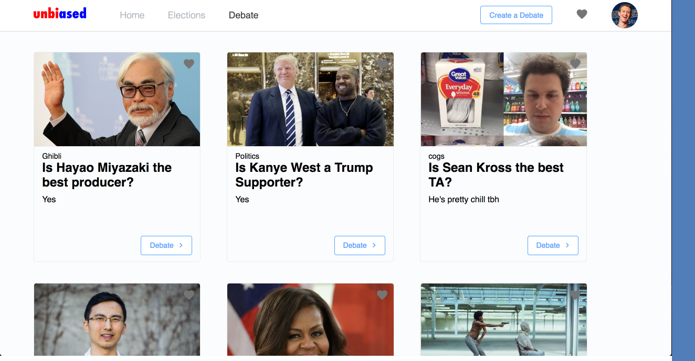
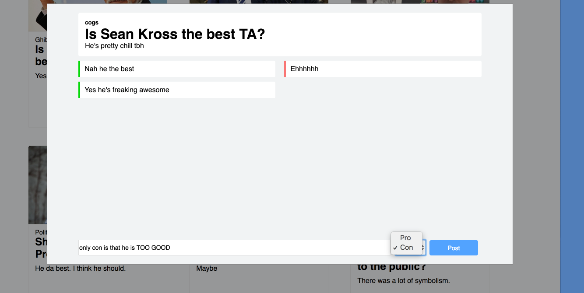

# unBiased

## Team Name: CJGJ 
- **Jan Eric De Castro**
- **Cameron Lee**
- **Joel Loo**
- **German Flores**

## UI Web Pages:

We refined our front end a bit more compared to the skeleton from last milestone's UI skeleton. We mostly created three main features in this application: seeing who your representatives are based on location, can see election locations, and debate on certain topics. We've been mostly working on these three features thus far. Furthermore, compared to the previous milestone, we've also worked heavily on the styling of the web page. Instead of just showing text from the data we pulled from our API, it shows information in cards. The header/menu in the top of the web page is also stylized.

- Here users can find their representative between by city and can see how they can contact them.

- Can see more details regarding their representative. Can see comments and view news related to the rep. Uses news api for data.

**UPDATE**
- [x] Autofill suggestions for finding nearby voting locations
       

**UPDATE2**
- [x] A more refined and cleaner display to see the elections available for search, thus optimizing the user's search.

**UPDATE3 - DATA VISUALIZATION**
- [x] A display of markers around the map interface in order to specify exact voting locations
      

**UPDATE4 - DATA VISUALIZATION (Cont.)**
- [x] A display of boxes containing information regarding each marker's voting locations.

- Overall, We made major updates to the map page in order to better visualize what is happening where. Users can now have an updated clean UI in order to optimize their search and find the right location for them. The maps' interactiveness allows for automatic and manual map scrolling to make things easier for the user. Lastly, our updates regarding the autofill will make a significant contribution to optimization.

**UPDATE5 - DEBATE PAGE**
- [x] Added the option to add an image to fill the preview of the topic debate in order to draw more interest to users whom want to participate in debates. 
- [x] Distributed debates into *2 sections* in order to mitigate an excess single row of messages updating too quickly and negatively disrupting the way the debates should work. Also split into 2 sections in order to highlight pros and cons and thus clearly defining issues and pros of a topic. This will overall help distinguish bewteen the different opinions.

- Overall, made changes to debate page in order to have a more controlled debate where people could easily visualize why people wanted to debate and what issues are at concerns to others by splitting the sections into PROS and CONS.

## 3 Different Functions:

1. First function: By entering your address, you can see who your representatives are. By clicking on a specific card, it will take you to a specific page that's dedicated to the representative you clicked on. You can see latest news about them and comment/debate.
2. Second Function: Our main data visualization function. By choosing your local election coming up, and entering your address, you can view a list of polling locations near you and also see these locations in a map.
3. Third Function: The debate function. You can create a debate topic using the button in the top-right side of the screen. After entering the question/topic, category, and description, you will see a card pop up. By clicking on "Debate" you can comment on that debate topic and see what others said as well. These are all stored in the firebase database so you can have a long debate conversation.
